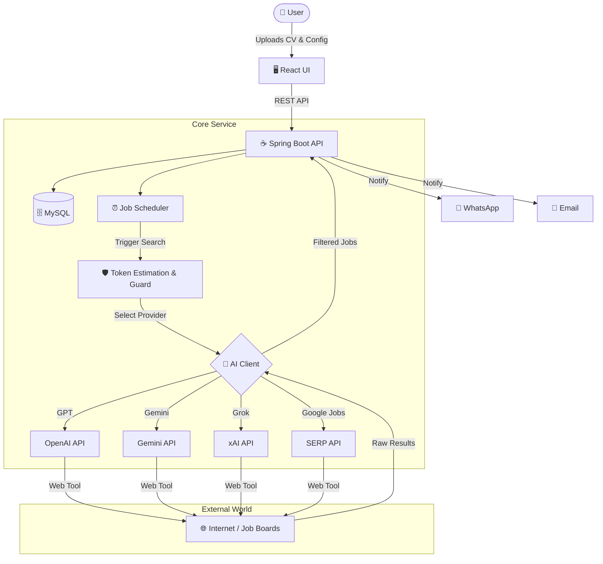

<div align="center">
  

  <h1 style="margin: 0px 0 0 0;">🚀 JobsHunter</h1>
  <p style="font-weight: 600; margin: 2px 0 8px 0;">Your AI-Powered Career Assistant</p>

  <div align="center">
    <a href="https://openjdk.org/"></a>
    <a href="https://spring.io/projects/spring-boot"></a>
    <a href="https://react.dev/"></a>
    
  </div>

  <p>
    <b>Search Smarter, Not Harder.</b><br>
    Automated job hunting tailored to your CV using state-of-the-art AI models.
  </p>
</div>

---

## 🌟 Why JobsHunter?

JobsHunter isn't just a scraper; it's an intelligent agent that understands *who you are*. By analyzing your uploaded CV and personal preferences, it navigates the web to find roles that actually fit.

### ✨ Key Features

| Icon | Feature | Description |
| :---: | :--- | :--- |
| 🧠 | **Multi-AI Brain** | Powered by **GPT-4/5** (OpenAI), **Gemini 1.5/2.0** (Google), **Grok** (xAI) and **SERP** (Google Jobs) for deep reasoning and context understanding. |
| 📄 | **Context-Aware** | Upload your PDF CV and let the AI extract your skills, experience, and seniority to filter noise. |
| 🛡️ | **Enterprise Stability** | Built with **Resilience4j** (Circuit Breakers, Rate Limiters, Bulkheads) and **Virtual Threads** for high concurrency. |
| 🕸️ | **Smart Web Search** | Uses AI tools to browse the web, parse job boards, and validate "Apply" links. |
| 📲 | **Instant Alerts** | Get notified via **WhatsApp** (Twilio) or **Email** (Mailtrap) the moment a match is found. |
| 🖥️ | **Modern Dashboard** | Clean, responsive UI built with **React**, **Vite**, and **Tailwind CSS**. |
| ⏱️ | **Set & Forget** | Configurable scheduler runs in the background, respecting cool-down periods and quotas. |

---

## 🏗️ Architecture



---

## 🛠️ Tech Stack

| Category | Technologies |
| :--- | :--- |
| **Backend** |         |
| **Frontend** |     |
| **Infrastructure** |    |

---

## 🌐 External Services

| Service           | Badge |
|:------------------| :--- |
| **AI Models**     |    |
| **Job Search**    |  |
| **Notifications** |   |
| **Utilities**     |   |

---

## 🚀 Getting Started

### Prerequisites

- **Java 25+** (for local backend run)
- **Node.js 20+** (for local frontend run)
- **Docker** (recommended for full stack)
- **MySQL 8.x**

### 🐳 Quick Start (Docker)

The easiest way to run everything (Backend + Frontend + DB):

```bash
# Clone the repository
git clone https://github.com/yourusername/jobshunter.git
cd jobshunter

# Build and start
docker compose up --build
```

> The UI will be available at http://localhost:5173 (or configured port) and API at http://localhost:8081.

### 💻 Local Development

#### 1. Backend
```bash
# Export environment variables (see Configuration)
export MYSQL_URL="jdbc:mysql://localhost:3306/jobshunter..."

# Build & Run
mvn clean install
mvn spring-boot:run
```

#### 2. Frontend
```bash
cd application/src/main/resources/frontend # (or root if package.json is there)
npm install
npm run dev
```

---

## 🧪 IntelliJ Run Configurations

Grab the provided `.run/JobsHunter-local.run.xml` or `.run/JobsHunter-prod.run.xml` and drop it into `.idea/runConfigurations/` if your IDE does not auto-import them. Both invoke `com.jobshunter.JobshunterApplication`; the only JVM argument that differs is `-Dspring.profiles.active`.

| Configuration | Notes |
| :--- | :--- |
| `JobsHunter-local` | Uses `-Dspring.profiles.active=local`, which wires the fake AI clients (they generate dummy results so you can test without hitting paid APIs). |
| `JobsHunter-prod` | Switches to `-Dspring.profiles.active=prod` for a production-like run with real provider integrations. |

Pick whichever configuration matches the environment you want to explore.

---

## ⚙️ Configuration

Configure the application via environment variables or `application.yml`.

### 🔑 Essential Credentials

| Variable | Description |
| :--- | :--- |
| `MYSQL_URL` | JDBC URL (e.g., `jdbc:mysql://localhost:3306/jobshunter`) |
| `MYSQL_USER` | Database username |
| `MYSQL_PASSWORD` | Database password |
| `JWT_SECRET` | Secret key for signing JWT tokens (min 32 chars) |

### 🤖 AI Providers (At least one recommended)

| Variable | Description |
| :--- | :--- |
| `CHATGPT_API_KEY` | Key for OpenAI models (GPT-4o, etc.) |
| `GEMINI_API_KEY` | Key for Google Gemini models |
| `GROK_API_KEY` | Key for xAI Grok models |
| `SERP_API_KEY` | Key for Google Jobs Search |

### 📢 Notifications (Optional)

| Variable | Description |
| :--- | :--- |
| `TWILIO_ACCOUNT_SID` | Twilio Account SID |
| `TWILIO_AUTH_TOKEN` | Twilio Auth Token |
| `TWILIO_WHATSAPP_FROM`| Sender number (e.g., `whatsapp:+14155238886`) |
| `TWILIO_JOBS_NOTIFY_MESSAGE_SID` | Content Template SID for rich messages |
| `MAILTRAP_USERNAME` | SMTP Username |
| `MAILTRAP_PASSWORD` | SMTP Password |
| `MAILTRAP_API_KEY` | API Key for template sending |
| `MAILTRAP_TEMPLATE_NEWJOBS` | Template UUID for new jobs notification |
| `MAIL_FROM` | Sender email address (default: `no-reply@mailtrap.io`) |

---

## 📚 API Reference

Once the application is running, explore the full REST API documentation via **Swagger UI**:

👉 **http://localhost:8081/swagger-ui.html**

---

## 🤝 Contributors

A huge shoutout to the amazing team behind JobsHunter!

<table>
  <tr>
    <td width="150" align="center" valign="top">
      <a href="https://github.com/crisnct">
        
      </a><br/>
      <b>Cristian Țone</b><br/>
      <sub>🚀 Product Owner & Team Lead</sub>
    </td>
    <td valign="top">
      <ul>
        <li>Strategy to search jobs by company</li>
        <li>Strategy to search jobs by user prompts</li>
        <li>Functionality to blame AI for the invalid URLs provided</li>
        <li>Async Search with Virtual Threads & CompletableFuture</li>
        <li>Rate Limiting & Circuit Breakers & Bulkhead for external services and JobsHunter endpoints</li>
        <li>Retry policy for http requests to AI models</li>
        <li>SERP & GPT & GEMINI & GROK Integrations</li>
        <li>Mailtrap & Twilio & TinyURL & IpInfo Integrations</li>
        <li>Docker & CI/CD</li>
        <li>Annotation processor</li>
        <li>Core Service Architecture</li>
        <li>Authentication and authorization</li>
        <li>Started the project</li>
      </ul>
    </td>
  </tr>
  <tr>
    <td width="150" align="center" valign="top">
      <a href="https://github.com/AyanoCode13">
        
      </a><br/>
      <b>Andrei Lazăr</b><br/>
      <sub>💻 Junior Backend Developer</sub>
    </td>
    <td valign="top">
      <ul>
        <li>Scrapper for bestjobs.eu</li>
        <li>Email Notification Service</li>
        <li>Mailtrap Integration</li>
      </ul>
    </td>
  </tr>
  <tr>
    <td width="150" align="center" valign="top">
      <a href="https://github.com/ionel-vochin">
        
      </a><br/>
      <b>Ionel Vochin</b><br/>
      <sub>🛠️ Senior Backend Developer</sub>
    </td>
    <td valign="top">
      <ul>
        <li>Refactoring & Optimization about email templates</li>
        <li>Liquibase Scripts Fixes</li>
        <li>RestClient Migration</li>
      </ul>
    </td>
  </tr>
  <tr>
    <td width="150" align="center" valign="top">
      <a href="https://github.com/Paulresiga92">
        
      </a><br/>
      <b>Paul Resiga</b><br/>
      <sub>🛠️ Applied AI Engineer</sub>
    </td>
    <td valign="top">
      <ul>
        <li>no contribution yet</li>
      </ul>
    </td>
  </tr>
  <tr>
    <td width="150" align="center" valign="top">
      <a href="https://github.com/rotaruciprian81">
        
      </a><br/>
      <b>Ciprian Rotaru</b><br/>
      <sub>🛠️ Senior Full-Stack Developer</sub>
    </td>
    <td valign="top">
      <ul>
        <li>...</li>
      </ul>
    </td>
  </tr>
  <tr>
    <td width="150" align="center" valign="top">
      <a href="https://github.com/georgianapastiu">
        
      </a><br/>
      <b>Georgiana Pastiu</b><br/>
      <sub>🛠️ Mid-Level Python Developer</sub>
    </td>
    <td valign="top">
      <ul>
        <li>no contribution yet</li>
      </ul>
    </td>
  </tr>

</table>

---

## 📄 License

This project is licensed under the **Business Source License 1.1** until **1 Jan 2035** - see the [LICENSE-EN](LICENSE-EN) file for details.  

<div align="left">
  <sub>Product made with ❤️ by the JobsHunter Team</sub>
</div>
