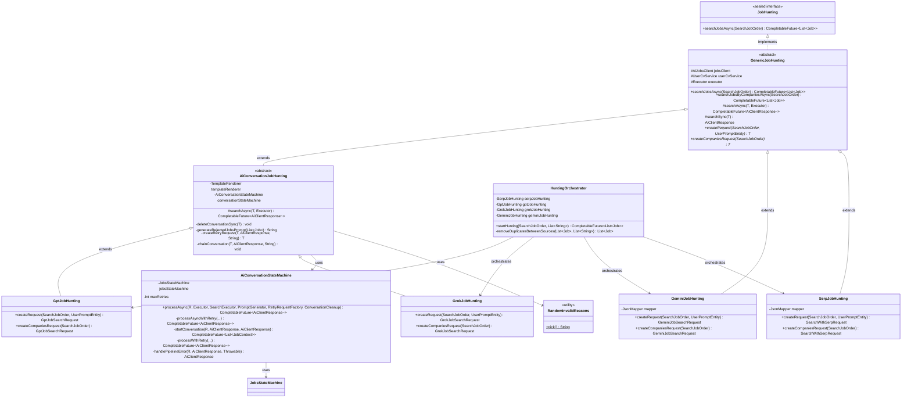
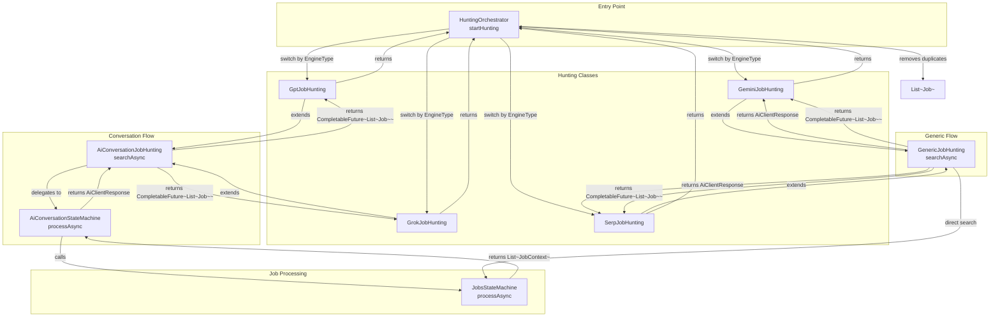
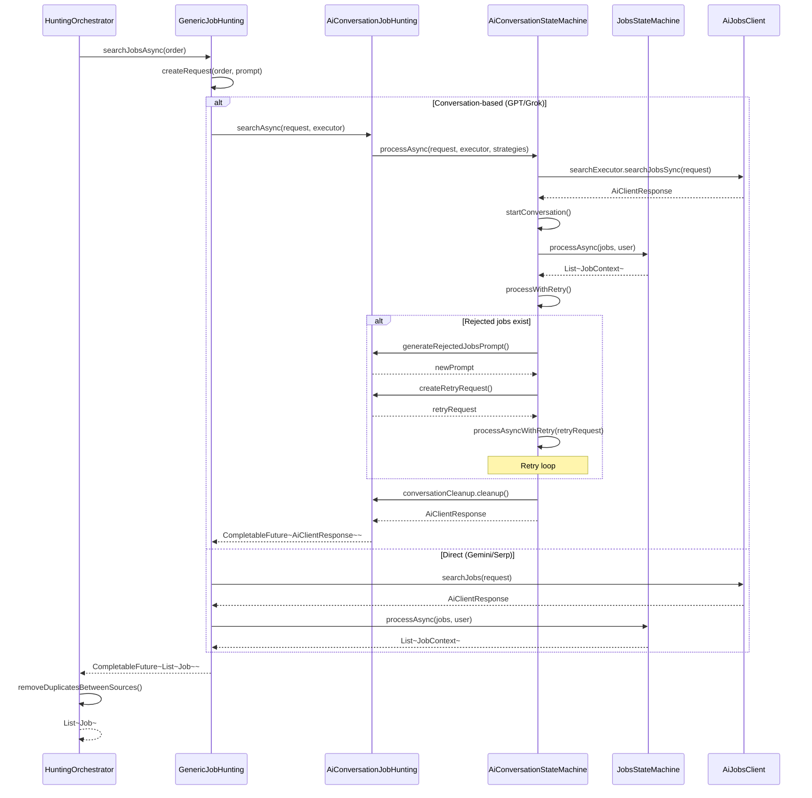

```
%%{init: {"themeVariables": {"fontSize": "18px"}}}%%
```

# Hunting Package Architecture Diagram

This diagram shows the complete architecture of the `hunting` package, including class inheritance hierarchy, relationships, dependencies, and data flow.

## Class Diagram




## Component Interaction Diagram



## Data Flow Diagram



## Key Relationships

### Inheritance Hierarchy

- **JobHunting** (sealed interface) - Root interface
  - **GenericJobHunting** (abstract) - Base implementation
    - **AiConversationJobHunting** (abstract) - Conversation-based hunting
      - **GptJobHunting** - GPT implementation
      - **GrokJobHunting** - Grok implementation
    - **GeminiJobHunting** - Gemini implementation
    - **SerpJobHunting** - SERP implementation

### Dependencies

- **AiConversationJobHunting** depends on:
  - `AiConversationStateMachine` - For conversation state management
  - `TemplateRenderer` - For prompt generation
  - `RandomInvalidReasons` - For invalid reason generation

- **All Hunting Classes** depend on:
  - `AiJobsClient` - For AI API communication
  - `UserCvService` - For CV management
  - `Executor` - For async execution

- **HuntingOrchestrator** depends on:
  - All concrete hunting implementations (GptJobHunting, GrokJobHunting, GeminiJobHunting, SerpJobHunting)

- **AiConversationStateMachine** depends on:
  - `JobsStateMachine` - For job processing pipeline

### Data Flow

1. **Entry**: `HuntingOrchestrator.startHunting()` receives `SearchJobOrder`
2. **Routing**: Based on `EngineType`, routes to appropriate hunting class
3. **Search**: Hunting class calls `searchJobsAsync()` which:
   - For GPT/Grok: Uses `AiConversationStateMachine` with retry logic
   - For Gemini/Serp: Direct search via `GenericJobHunting`
4. **Processing**: All jobs go through `JobsStateMachine.processAsync()` for validation
5. **Return**: Processed jobs are returned and duplicates are removed
6. **Result**: Final list of unique, validated jobs

## Notes

- **Sealed Interface**: `JobHunting` is sealed and only permits `GenericJobHunting`
- **Strategy Pattern**: `AiConversationStateMachine` uses functional interfaces for strategies
- **Retry Logic**: GPT and Grok implementations support retry with modified prompts
- **Parallel Processing**: Multiple prompts are processed in parallel using `CompletableFuture`
- **Duplicate Removal**: `HuntingOrchestrator` removes duplicates across all sources
