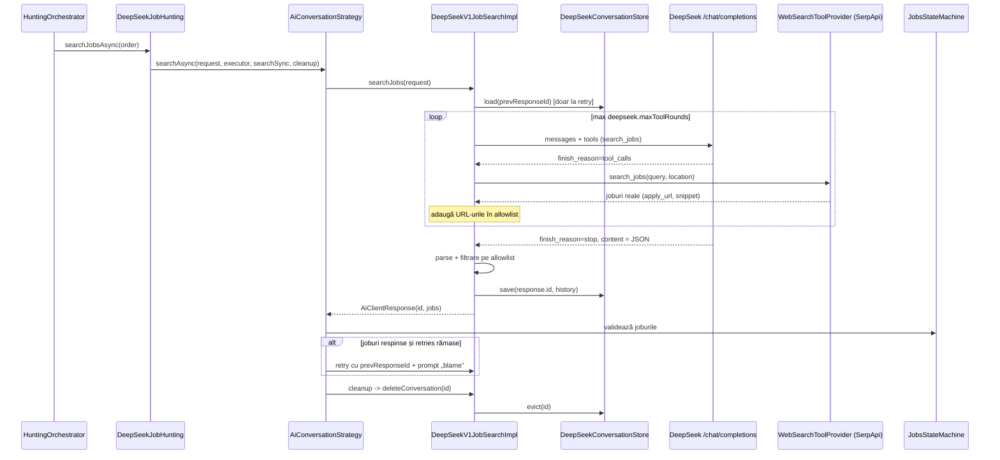

# Plan de implementare: DeepSeek V4.1 Flash ca motor de căutare joburi

> Status: **propunere** · Data: 2026-10-05 · Scope: `EngineType.DEEPSEEK`, model `deepseek-flash`
>
> Căile Java din acest document sunt relative la `application/src/main/java/com/jobshunter/`, iar
> `resources/` înseamnă `application/src/main/resources/`.

## 1. Rezumat

DeepSeek V4.1 Flash (`deepseek-flash`) e foarte ieftin și are context de 1M tokeni, dar **nu are web search
built-in, nu are Files API și e stateless** (nu păstrează conversații pe server). Toate motoarele AI
actuale (GPT, Grok, Gemini) se bazează pe web search-ul nativ al providerului ca să găsească URL-uri de
joburi. Deci DeepSeek **nu poate fi doar „încă un client copiat după Grok”**: trebuie să-i dăm noi
capacitatea de căutare.

**Abordarea recomandată:** un client DeepSeek care rulează o **buclă de function calling** (agent loop).
Modelul primește un tool `search_jobs` (și opțional `fetch_page`), pe care **backend-ul îl execută** prin
SerpApi (deja integrat). La final modelul returnează JSON cu URL-urile alese, iar acestea sunt filtrate
contra URL-urilor reale întoarse de tool-uri (protecție anti-halucinație), apoi intră în
`JobsStateMachine` exact ca la celelalte motoare.

Conversația de retry (`AiConversationStrategy`) se păstrează **client-side** într-un
`DeepSeekConversationStore`, astfel încât contractele existente (`ConversationBuilder.prevResponseId`,
`DeleteConvAiClient`) rămân neschimbate.

## 2. Ce oferă API-ul DeepSeek (verificat în documentația oficială, oct. 2026)

| Aspect | Situație | Impact asupra JobsHunter |
|---|---|---|
| Model ID | `deepseek-flash` (= V4.1-Flash). `deepseek-v4-flash` e alias depreciat, rutat tot spre V4.1-Flash | Folosim `deepseek-flash` în `ai_models` |
| Endpoint | `POST https://api.deepseek.com/chat/completions` (format OpenAI), Bearer auth. Există și `/responses` și format Anthropic | Recomand **Chat Completions** (vezi §3.1) |
| Context / output | 1M context, max 384K output | `context_window = 1048576` |
| Web search built-in | **Nu există.** În Responses API, tool-urile `web_search`/`file_search` sunt **ignorate silențios** | Trebuie function tool executat de backend |
| Files API / `input_file` | **Nu** | CV-ul nu poate fi atașat ca `fileId`; nu implementăm `FileClient` |
| Conversații stocate | **Nu** (`store` mereu false, `previous_response_id` ignorat) | Istoric ținut în aplicație |
| JSON output | `response_format: {"type":"json_object"}` (fără `json_schema`); prompt-ul trebuie să conțină cuvântul „json” + un exemplu | Schema se pune în prompt, nu ca `json_schema` |
| Function calling | Da; `strict: true` (beta, pe `https://api.deepseek.com/beta`) validează argumentele contra schemei | Opțional: tool terminal `submit_job_results` cu `strict` |
| Thinking | `thinking: {type: enabled/disabled}`, `reasoning_effort: none/low/high/max`; `temperature` nu are efect în thinking mode | Discovery în non-thinking (mai ieftin, mai simplu cu tool-uri) |
| Usage | `prompt_tokens`, `completion_tokens`, `prompt_cache_hit_tokens`, `prompt_cache_miss_tokens`, `reasoning_tokens` | Mapare nouă în `TokensConsumedMapper` |
| Preț | Off-peak (per 1M): input cache-miss $0.15, cache-hit $0.003, output $0.60. **Peak (UTC 01–04, 06–10, L–V) = dublu** | `ai_models` are un singur preț → vezi §6 |

> ⚠️ Prețurile și numele modelului se schimbă des la DeepSeek (au mai fost modificate în aug. 2026).
> Re-verifică pagina de pricing înainte de a scrie changeset-ul Liquibase.

## 3. Decizii de design

### 3.1 Chat Completions, nu Responses API

Responses API de la DeepSeek e un strat de compatibilitate care **ignoră fără eroare** parametrii
nesuportați (`store`, `previous_response_id`, `web_search`, `input_file`). Dacă am refolosi
`GrokJobsPayload` am obține un client care „merge”, dar fără căutare și fără retry — bug tăcut.
Chat Completions e API-ul nativ, complet documentat (json_object, strict tools, thinking, cache usage).
→ DTO-uri proprii în `dto/deepseekRequest/` și `dto/deepseekResponse/`.

### 3.2 Căutarea: function calling cu tool executat de backend

```
tools:
  search_jobs(query: string, location: string, page_token?: string)
      -> backend: SerpApi engine=google_jobs  -> listă {title, company, location, apply_url, snippet}
  fetch_page(url: string)                      [opțional, faza 4]
      -> backend: HttpFetcher (NU Playwright – executorul lui are 1 thread)
      -> text curățat, trunchiat la N caractere
```

- Abstracție nouă `WebSearchToolProvider` (în `service/clients/deepseek/tools/`), cu implementarea
  implicită pe SerpApi. Permite ulterior Brave/Tavily fără a atinge clientul.
- Logica SerpApi există deja în `SerpClientImpl`, dar e legată de `SerpSearchRequest` și de modelul din
  order. Recomand extragerea metodelor `searchJobsPagination`/`buildUri` într-un component reutilizabil
  (ex. `SerpGoogleJobsSearcher`) folosit și de `SerpClientImpl`, și de tool.
- Bucla e limitată de `deepseek.maxToolRounds` (ex. 5) și de numărul total de tool calls per request.
- **Anti-halucinație:** clientul ține un `Set<String>` cu toate URL-urile întoarse de tool-uri în
  conversația curentă; URL-urile finale care nu sunt în set sunt eliminate (log + metrică). Economisește
  fetch-uri Playwright pe URL-uri inventate.
- Descrierea din SerpApi se poate atașa ca `JobMetadataType.SERP_DESCRIPTION` (exact ca `SerpClientImpl`),
  ceea ce îmbunătățește scoring-ul.

### 3.3 Retry conversațional fără stare pe server

`AiConversationStrategy.createRetryRequest` setează `prevResponseId` și cere jobs noi pentru URL-urile
respinse. Pentru DeepSeek:

- `DeepSeekConversationStore` (component, `ConcurrentHashMap<String, List<ChatMessage>>` + TTL, curățat
  pe `maintenanceExecutor`; sau Caffeine dacă e deja pe classpath).
- După fiecare apel, clientul salvează istoricul complet (system, user, assistant cu `tool_calls`,
  mesaje `tool`) sub `response.id` și pune acel id în `AiClientResponse.setId(...)`.
- La retry: dacă `prevResponseId != null`, încarcă istoricul, adaugă noul mesaj user (prompt-ul „blame”)
  și retrimite. Context caching-ul DeepSeek face ca prefixul repetat să coste ~$0.003/1M.
- `deleteConversation(id)` din `DeleteConvAiClient` = evict din store.
- Rezultat: `DeepSeekJobHunting` folosește `AiConversationStrategy` **fără nicio modificare** în strategie
  sau în `AiConversationStateMachine`.
- Dacă se activează thinking mode cu tool calls, `reasoning_content` trebuie păstrat în istoric între
  rundele de tool-uri (cerință DeepSeek) — încă un motiv pentru non-thinking pe discovery.

### 3.4 Format răspuns

- MVP: `response_format: json_object` + schema existentă (`grok_json_schema_response.json`, copiată ca
  `deepseek_json_schema_response.json`) randată **în system prompt**, cu un exemplu.
- Parsare identică cu `GrokV1JobSearchImpl.extractJobs` (`JobSearchResponse.results[].job_posting_url`),
  cu fallback pe `UrlExtractor.parseJobs` dacă JSON-ul e invalid sau `content` e gol (documentat că se
  poate întâmpla în JSON mode).
- Variantă mai robustă (după MVP): tool terminal `submit_job_results(results[])` cu `strict: true`
  pe endpoint-ul beta → argumente garantat conforme cu schema.

### 3.5 CV-ul

Căutarea pe prompt (Grok/GPT) nu atașează CV-ul — trimite doar prompt-ul userului. Deci MVP-ul **nu are
nevoie de CV**. Scoring-ul cu DeepSeek (faza 5) are nevoie de textul CV-ului, iar proiectul nu are
bibliotecă de extragere PDF → PDFBox + coloană `cv_text` (sau extragere la cerere).

## 4. Diagrama fluxului (search by prompt)



## 5. Modificări pe fișiere

### 5.1 Fișiere noi

| Fișier | Rol |
|---|---|
| `dto/DeepSeekSearchRequest.java` | Request imutabil, cu `Builder implements JobSearchRequest.ConversationBuilder` (copie după `GrokSearchRequest`: `prevResponseId`, `company`, `discoveryModel`, `companiesModel`, `countryIsoCode`) |
| `dto/deepseekRequest/*` | `DeepSeekChatPayload` (cu `aiModel()` pt. cost, builder ca la Grok), `ChatMessage` (role, content, `tool_calls`, `tool_call_id`, `reasoning_content`), `ToolDefinition`, `FunctionDefinition`, `ResponseFormat`, `Thinking` |
| `dto/deepseekResponse/*` | `DeepSeekChatResponse` (id, choices[], usage), `Choice` (message, finish_reason), `ToolCall`, `Usage` (inclusiv cache hit/miss, reasoning tokens) |
| `service/clients/deepseek/DeepSeekV1JobSearchImpl.java` | `@Component("JobsClientDEEPSEEK")`, `@ConditionalOnProperty(deepseek.enabled=true)`, implementează `AiJobsClient`, `AiJobsCompaniesClient`, `DeleteConvAiClient`; resilience4j + `RetryTemplate` ca la Grok; bucla de tool calls |
| `service/clients/deepseek/DeepSeekConversationStore.java` | Istoric conversații client-side cu TTL |
| `service/clients/deepseek/tools/WebSearchToolProvider.java` + `SerpWebSearchToolProvider.java` | Execuția tool-ului `search_jobs` |
| `service/clients/deepseek/tools/DeepSeekToolExecutor.java` | Dispatch `tool_call.function.name` → implementare, serializare rezultat ca mesaj `tool` |
| `service/clients/serp/SerpGoogleJobsSearcher.java` | Logica SerpApi extrasă din `SerpClientImpl` (refolosită) |
| `service/application/hunting/hunters/DeepSeekJobHunting.java` | Copie structurală după `GrokJobHunting`, cu `@Qualifier("deepseekSearchExecutor")`, `@Qualifier("JobsClientDEEPSEEK")`, `AiConversationStrategy`, `fileId = null` |
| `service/testdata/FakeDeepSeekClient.java` | Bean pe `deepseek.enabled=false` (profil `local`) |
| `resources/schema/deepseek_json_schema_response.json`, `deepseek_json_company_schema_response.json` | Obligatorii: `TemplateRenderer` încarcă la startup câte un fișier pentru fiecare valoare `AiSchemaType` |
| `resources/prompts/system_prompt_job_search_deepseek.mustache` (opțional) | Instrucțiuni specifice tool-urilor: „folosește search_jobs, nu inventa URL-uri, răspunde în json…” |
| `resources/db/changelog/2026-10-xx-add-deepseek-ai-model.xml` | Insert model + capabilities (vezi §6) |

### 5.2 Fișiere modificate

| Fișier | Modificare |
|---|---|
| `model/EngineType.java` | `+ DEEPSEEK` (`isAiProvider()` rămâne true) |
| `model/AiSchemaType.java` | `+ DEEPSEEK_JSON_SCHEMA_RESPONSE`, `DEEPSEEK_JSON_COMPANY_SCHEMA_RESPONSE` |
| `dto/JobSearchRequest.java` | `permits ... DeepSeekSearchRequest` |
| `service/clients/AiJobsClient.java`, `AiJobsCompaniesClient.java`, `DeleteConvAiClient.java` | `permits DeepSeekV1JobSearchImpl` (+ `FakeDeepSeekClient` unde e cazul) |
| `service/application/hunting/JobHunting.java` | `permits DeepSeekJobHunting` |
| `service/application/cost/DefaultCostService.java` | `getSafetyRatio`: `case DEEPSEEK -> 0.85f` — **switch exhaustiv fără default, altfel nu compilează** |
| `service/application/cost/TokenEstimationGuard.java` + `TokenEstimationMapper.java` | Overload `assertFitsContext(DeepSeekChatPayload)` / `from(DeepSeekChatPayload)` (mesaje + tools + schema din prompt + `max_tokens`) |
| `service/application/cost/TokensConsumedMapper.java` | `fromDeepSeek(Usage)`: input = `prompt_tokens`, output = `completion_tokens`, toolCalls = nr. de execuții `search_jobs` |
| `service/application/cost/AiCostPublisher.java` | `publishDeepSeek(...)` |
| `config/ApplicationProperties.java` | `DeepSeek { apiKey, enabled, threads, baseUrl, maxToolRounds, conversationTtl }` |
| `service/ExecutorsConfig.java` | Bean `deepseekSearchExecutor` |
| `controller/MonitoringController.java` | Rând „DeepSeek” pentru executor |
| `controller/TestController.java` | `case DEEPSEEK` în switch-urile de construire request (~l. 483, ~533) |
| `resources/application.yml` | Bloc `deepseek:` (`enabled`, `apiKey: ${DEEPSEEK_API_KEY:notset}`, `threads`, `baseUrl`, `maxToolRounds`) + `resilience4j` `deepseekLimiter` / `deepseekCircuitBreaker` / `deepseekBulkhead` |
| `resources/application-local.yml` | `deepseek.enabled: false` + instanțele resilience4j permisive |
| `docker-compose.yml`, `.github/workflows/deploy.yml`, README | Variabila `DEEPSEEK_API_KEY` |
| `test/.../SqlTestDataInitializer.java` | `seedIfMissing(..., EngineType.DEEPSEEK, "deepseek-flash")` |

**Neschimbate în MVP** (au `default` în switch): `JobScoringProcessor`, `JobsStateMachine`, `TestService`.
`UserCvService` rămâne fără client DeepSeek (nu există Files API). `HuntingOrchestrator` preia automat
noul `JobHunting` din lista de bean-uri. `InternalMcpController` / frontend-ul văd modelul nou prin
`ai_models` odată ce e `enabled`.

## 6. Baza de date (Liquibase)

```sql
INSERT INTO ai_models (provider, model, enabled, context_window, tokens_per_char,
                       input_price, output_price, tool_price)
VALUES ('DEEPSEEK', 'deepseek-flash', 1, 1048576, <aceeași valoare ca la Grok>,
        0.30, 1.20, <cost SerpApi per 1M apeluri>);
```

- **Preț:** `ai_models` suportă un singur preț per model. Recomand **prețul de peak** (dublul celui
  off-peak) ca estimare conservatoare. Dacă vrei cost exact: `RequestPriceService.calculatePrice` poate
  aplica multiplicator după ora UTC, iar `TokensConsumed` ar putea primi `cachedInputTokens`
  (cache-hit e de ~50x mai ieftin) — îmbunătățire separată.
- **`tool_price`:** aici se poate modela costul SerpApi per apel `search_jobs`, ca să apară în costul
  order-ului.
- **Capabilities** (`ai_models_capability`): `SYSTEM_PROMPT`, `RESPONSE_SCHEMA`, `REASONING`,
  `TEMPERATURE` = true; `WEB_SEARCH`, `FILE_UPLOAD` = false (web search e emulat de noi, nu nativ).
- Verifică faptul că `ai_models.provider` e `VARCHAR`, nu `ENUM` în MySQL (dacă e enum → `ALTER`).
- Precondition `sqlCheck` ca în `2026-02-20-add-scraper-bestjobs-ai-model.xml`; include-l în
  `db.changelog-master.xml`.

## 7. Reziliență și configurare

- **Rate limit DeepSeek:** nu există limită fixă publicată (e dinamică după load). Pornește cu valorile
  de la Grok (`limitForPeriod: 1/1s`, bulkhead 3 concurente) și ajustează.
- **Gâtul de sticlă real e SerpApi:** `serpLimiter` în prod = 1 request / 20s. Fiecare `search_jobs` din
  buclă trece prin el → o căutare cu 3–5 tool calls poate dura minute. Opțiuni: limiter separat
  `serpToolLimiter`, cache pe `(query, location)` pentru câteva ore, sau provider de search diferit.
- **Timeouts:** sub load DeepSeek poate ține conexiunea deschisă mult timp. Setează explicit read timeout
  pe `RestClient`-ul folosit (sau unul dedicat) și `slowCallDurationThreshold` în circuit breaker.
- `@Timed(value = "ai.api.search", extraTags = {"provider","deepseek",...})` ca la Gemini.
- `@PackageExpected("com.jobshunter.service.clients.deepseek")` pe client și pe fake.

## 8. Faze de implementare

| Fază | Conținut | Livrabil verificabil |
|---|---|---|
| **0. Spike** (0.5 zi) | Cheie API, `curl` pe `/chat/completions` cu `deepseek-flash`: json_object, un tool call, latență, usage. Confirmă prețurile | Notițe + exemple JSON reale pentru testele WireMock |
| **1. Plumbing** (1 zi) | `EngineType`, `AiSchemaType` + fișiere schema, properties, yml, executor, Liquibase, sealed `permits`, `FakeDeepSeekClient`, `DeepSeekJobHunting` minimal | `mvn clean install` verde; app pornește pe `local`; un order DEEPSEEK trece prin pipeline cu fake client |
| **2. Client + search by prompt** (2 zile) | DTO-uri, `DeepSeekV1JobSearchImpl.searchJobs` cu buclă de tool-uri, `SerpGoogleJobsSearcher`, allowlist URL, cost/token mapping | Test WireMock: tool_calls → stop → joburi; order real pe `prod` cu cost înregistrat |
| **3. Retry conversațional** (1 zi) | `DeepSeekConversationStore`, `deleteConversation`, integrare `AiConversationStrategy` | Test: retry trimite istoricul + prompt blame; store golit după cleanup |
| **4. Search by company** (1–1.5 zile) | `searchCompanies` (fără tool-uri — exact ca la Grok, unde nici el nu folosește web search), `searchJobsFromCompanies` cu `fetch_page(careers_page)` + `search_jobs` | Joburi `COMP-deepseek-flash` în rezultate |
| **5. Scoring (opțional)** (1–1.5 zile) | PDFBox, text CV persistat, `DeepSeekJobScoreCalculatorClientImpl`, `case DEEPSEEK` în `JobScoringProcessor`/`JobsStateMachine`/`TestService` | Scoring ieftin; comparație scoruri vs Gemini pe același set |
| **6. Documentație** (0.5 zi) | Actualizare `hunting-architecture.md` (e deja depășit: mai descrie `GenericJobHunting`/`AiConversationJobHunting`, înlocuite de `JobSearchStrategy`), `CLAUDE.md`, README, diagramele `aijobsclient-*.puml` | — |

## 9. Teste

- `DeepSeekV1JobSearchImplTest` (WireMock): răspuns direct JSON; buclă cu 2 runde de tool calls;
  `maxToolRounds` depășit; JSON invalid → fallback `UrlExtractor`; `content` gol; URL halucinat eliminat.
- `DeepSeekConversationStoreTest`: save/load/evict/TTL.
- `TokensConsumedMapperTest.fromDeepSeek`, `TokenEstimationMapper.from(DeepSeekChatPayload)`.
- `SerpWebSearchToolProviderTest` (WireMock pe SerpApi) + test de regresie pentru `SerpClientImpl` după
  extragerea `SerpGoogleJobsSearcher`.
- Test de context Spring pe profilul `test` că bean-urile fake/real se rezolvă corect pentru ambele
  valori ale `deepseek.enabled`.

## 10. Riscuri

| Risc | Mitigare |
|---|---|
| URL-uri halucinate (fără web search nativ) | Allowlist din rezultatele tool-urilor; prompt explicit |
| Parametri nesuportați ignorați silențios | Chat Completions nativ, nu payload-ul Grok pe `/responses`; teste pe payload-ul serializat |
| Latență mare din cauza `serpLimiter` | Limiter/cache dedicat pentru tool; `maxToolRounds` mic |
| Cost subestimat la peak / fără cache-hit în calcul | Preț peak în DB; îmbunătățire ulterioară a `RequestPriceService` |
| Schimbări frecvente de model/preț la DeepSeek | Model ID și prețuri doar în DB/config, nu hardcodate în afară de `init()` din hunter |
| Confidențialitate: datele userului (prompt, ulterior CV) ajung la un provider nou, cu servere în China | Decizie de produs / GDPR înainte de faza 5; eventual consimțământ explicit al userului |

## 11. Decizii deschise

1. **Backend-ul tool-ului de căutare:** SerpApi `google_jobs` (recomandat, deja integrat și plătit) sau alt
   API (Brave/Tavily) pentru căutare web generică?
2. **Thinking mode** pentru discovery: non-thinking (recomandat, ieftin) sau `reasoning_effort: low`?
3. **Faza 5 (scoring cu DeepSeek)** intră în scope sau rămâne Gemini?
4. Ce modele folosește `DeepSeekJobHunting.init()`: `deepseek-flash` pentru ambele (discovery și
   companies) sau `deepseek-v4-pro` pentru companies?

## Surse

- [DeepSeek – Models & Pricing](https://api-docs.deepseek.com/quick_start/pricing)
- [DeepSeek – Create Chat Completion](https://api-docs.deepseek.com/api/create-chat-completion/)
- [DeepSeek – Using the Responses API](https://api-docs.deepseek.com/guides/responses_api/)
- [DeepSeek – Responses API reference](https://api-docs.deepseek.com/api/create-response/)
- [DeepSeek API docs (overview)](https://api-docs.deepseek.com/)
