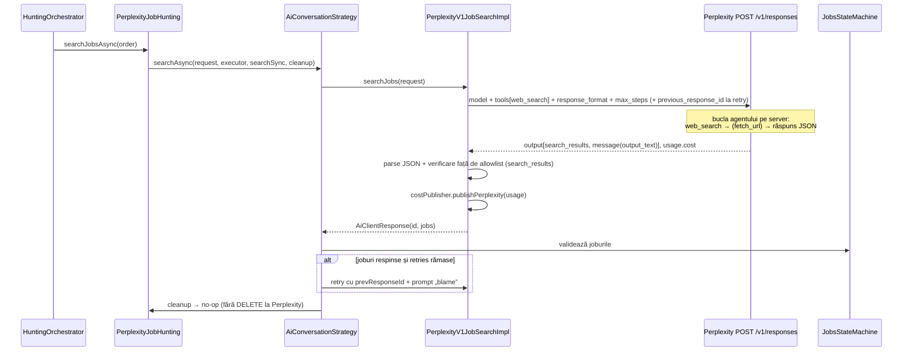

# Plan de implementare: Perplexity (Agent API, format Responses) ca motor de căutare joburi

> Status: **implementat (faze 1–4 + 6), nevalidat pe API-ul real** · Data: 2026-10-05 · Scope: `EngineType.PERPLEXITY`, endpoint `POST /v1/responses`
>
> Căile Java din acest document sunt relative la `application/src/main/java/com/jobshunter/`, iar
> `resources/` înseamnă `application/src/main/resources/`.

## 1. Rezumat

**Da, Perplexity suportă web search** și e chiar produsul lor de bază. Din 2026 API-ul principal este
**Agent API** (`POST https://api.perplexity.ai/v1/agent`), care are **format OpenAI Responses** și un alias
oficial **`POST https://api.perplexity.ai/v1/responses`**. Are tool-uri executate pe server
(`web_search`, `fetch_url`), structured output cu `json_schema`, conversații prin
`previous_response_id` și raportează costul exact în USD în fiecare răspuns.

**Abordarea recomandată:** un client `PerplexityV1JobSearchImpl` pe **Responses API** (`/v1/responses`),
construit ca o copie structurală a `GrokV1JobSearchImpl` (același flux: payload → `restClient.post()` →
parsare `output[]` → `AiClientResponse`). Hunter-ul `PerplexityJobHunting` folosește
**`AiConversationStrategy` fără modificări**: retry-ul cu joburile respinse merge pe
`previous_response_id`, exact ca la GPT/Grok.

Spre deosebire de DeepSeek (vezi `deepseek-integration-plan.md`), **nu trebuie emulat web search-ul** și
nici păstrat istoricul conversației în aplicație. Diferențele față de Grok sunt mici, dar reale (§3) și
justifică DTO-uri proprii.

### De ce nu Chat Completions / Sonar / Router

| Variantă | Verdict |
|---|---|
| **Sonar Chat Completions** (`messages`, `choices`) | Suportul s-a **încheiat pe 27.09.2026**. Cererile sincrone mai merg doar pentru că Perplexity le reformulează intern ca cereri Agent API. Nu construim pe el. |
| **Router API** (`POST /router/v1/responses`) | E doar un gateway spre modele: întoarce **400** pentru `previous_response_id`, pentru `store: true` și pentru `text.format` json_schema, iar documentația nu menționează `web_search`. Nu e potrivit. |
| **Agent API / `POST /v1/responses`** | ✅ Format Responses, web search pe server, json_schema, `previous_response_id`. **Ăsta e cel ales.** |
| **Search API** (`POST /search`, $5/1K) | Doar rezultate brute, fără LLM. Poate fi folosit ulterior ca backend pentru tool-ul `search_jobs` din planul DeepSeek, dar nu ca motor. |

## 2. Ce oferă API-ul Perplexity (verificat în documentația oficială, oct. 2026)

| Aspect | Situație | Impact asupra JobsHunter |
|---|---|---|
| Endpoint | `POST https://api.perplexity.ai/v1/responses` (alias pentru `/v1/agent`), Bearer auth | `DEFAULT_URI` în client |
| Selecție model | `model` (`"provider/model"`, ex. `openai/gpt-6-luna`), sau `models[]` (fallback, max 5), sau `preset` (`fast`/`low`/`medium`/`high`/`xhigh`) | Folosim `model` explicit din `ai_models`, nu preset (§3.2) |
| Web search | Tool `{"type":"web_search"}` cu `search_type` (`web`/`fast`), `search_context_size` (`low`/`medium`/`high`), `max_results` (1–50), `filters` și `user_location` | Înlocuiește `Tools.setWebSearch()` de la Grok |
| Filtre de căutare | `filters.search_domain_filter` (max 20, allowlist **sau** denylist cu prefix `-`), `search_recency_filter` (`hour`…`year`), `search_after_date_filter` / `search_before_date_filter` (`MM/DD/YYYY`), `last_updated_*_filter` | Blacklist → denylist; recency `month`; domeniul companiei la căutarea pe companii |
| `user_location` | `{city, region, country (ISO 3166-1), latitude, longitude}`, **fără** `type: "approximate"` | DTO propriu, nu `grokRequest.tools.UserLocation` |
| Fetch pagină | Tool `{"type":"fetch_url", "max_urls": 1..10}` | Util pentru `careers_page` la căutarea pe companii |
| Bucla agentului | `max_steps` (1–100; default 1 pentru modelele directe) | Limitează explicit costul și latența |
| Structured output | **`response_format`** pe nivelul de sus: `{type:"json_schema", json_schema:{name, schema, strict}}`. JSON-ul vine în `output_text` | **Diferă de Grok/GPT** (`text.format`), deci e nevoie de DTO propriu |
| Prima cerere cu o schemă nouă | Compilarea schemei durează **10–30 s** și poate da timeout | Timeout de citire generos + warm-up la startup (opțional) |
| Avertisment URL-uri | Docs: modelele pot produce URL-uri **malformate sau inventate** dacă li se cer link-uri în JSON; recomandă `search_results`/citations | Allowlist din `search_results` (§3.4) |
| Conversații | `previous_response_id` (răspunsul anterior trebuie să fie `completed`). `store:false` doar ascunde răspunsul la GET; **poate fi folosit în continuare ca bază de continuare** | Retry conversațional nativ, cu `store:false` |
| Ștergere conversație | **Nu există endpoint DELETE** (doar GET și cancel). Retenția nu e documentată | Nu implementăm `DeleteConvAiClient` (§3.3) |
| Fișiere | `input_file` inline (base64 sau `file_url`; PDF/DOC/DOCX/TXT/RTF), **fără Files API cu id-uri**. **Când un document e atașat, tool-urile de browsing nu sunt disponibile** | Nu atașăm CV-ul la discovery, nu implementăm `FileClient` |
| Usage | `input_tokens`, `output_tokens`, `input_tokens_details.cache_*`, `tool_calls_details.<tool>.invocation`, **`cost.total_cost` (USD)** | Cost exact, fără estimare (§6) |
| Output items | `message` (content `output_text` + annotations), `search_results` (`url`, `title`, `snippet`, `date`, `last_updated`), `fetch_url_results`, `function_call` etc. | Parsare pe tipuri |
| Background mode | `background: true` → `status: "queued"`, poll prin GET | Doar în faza opțională (§8) |
| Rate limit | Pe tier, după cât s-a cheltuit cumulat: Tier 0 = **1 QPS**, T1 ($50+) = 3, T2 ($250+) = 8, T3 = 17, T4–5 = 33. **429 + `Retry-After`, iar cererile respinse nu se facturează** | Limiter de 1/1s la start; retry care respectă `Retry-After` |

### Prețuri (pagina oficială de pricing, oct. 2026)

| Element | Preț |
|---|---|
| `web_search` (`search_type: web`) | $0.0025 / apel ($2.50 / 1K) |
| `web_search` (`search_type: fast`) | $0.001 / apel ($1.00 / 1K) |
| `fetch_url` | $0.0005 / apel |
| `openai/gpt-6-luna` | $0.10–0.20 input / $0.50–0.75 output per 1M (prețul crește peste ~272K tokeni input) |
| `google/gemini-3.5-flash-lite` | $0.30 / $2.50 per 1M |
| `anthropic/claude-haiku-4-5` | $1 / $5 per 1M |
| Presetul `low` | `gpt-6-luna`, max 5 pași, `web_search` + `fetch_url` |

> ⚠️ **Model ID-urile din documentație nu sunt consecvente între pagini** (exemplul din API reference
> folosește `openai/gpt-5.6-terra`, iar presets/models folosesc `openai/gpt-6-luna`). În spike (faza 0)
> se ia lista reală cu `GET https://api.perplexity.ai/v1/models` înainte de a scrie changeset-ul Liquibase.

**Ordin de mărime per căutare** (gpt-6-luna, 4 apeluri `web_search`, ~30K input / ~3K output):
≈ $0.006 + $0.002 + $0.010 ≈ **$0.02**. Cu `maxRetries` din `AiConversationStrategy` se înmulțește cu
numărul de runde. **Costul e dominat de tool calls, nu de tokeni**, deci `max_steps` și `max_results`
sunt principalele pârghii de cost.

## 3. Decizii de design

### 3.1 Responses API nativ (`/v1/responses`), cu DTO-uri proprii

Payload-ul seamănă mult cu `GrokJobsPayload`, dar refolosirea lui ar produce bug-uri tăcute:

| Câmp | Grok / GPT | Perplexity |
|---|---|---|
| Schema de răspuns | `text: {format: {type: json_schema, …}}` | `response_format: {type: json_schema, json_schema: {name, schema, strict}}` |
| Web search | `{"type":"web_search","user_location":{"type":"approximate",…}}` | `{"type":"web_search","search_context_size","max_results","filters":{…},"user_location":{…}}` |
| Bucla de tool-uri | implicită | `max_steps` explicit |
| Usage | tokeni + `num_server_side_tools_used` | tokeni + `tool_calls_details` + `cost.total_cost` |
| Output | `message` | `message` + `search_results` + `fetch_url_results` |

→ DTO-uri noi în `dto/perplexityRequest/` și `dto/perplexityResponse/`. Clasele de input (`Input`,
`InputMessage`, `AssistantInput`) se copiază după `grokRequest` (aceeași formă Responses), ca să rămână
consecvent cu stilul „un pachet de DTO-uri per provider” din proiect.

`PerplexityJobsPayload` păstrează gating-ul pe capabilities prin `AiCapabilityChecker`, ca la Grok:
`instructions`/system prompt pe `SYSTEM_PROMPT`, `response_format` pe `RESPONSE_SCHEMA`, tool-urile pe
`WEB_SEARCH` și `reasoning` pe `REASONING`.

### 3.2 Model explicit, nu preset

Presetul (`low`) aduce cu el un system prompt și parametri de căutare ascunși, care se schimbă când îi
modifică Perplexity. Pentru costuri predictibile și pentru `ai_models` (un rând = un model cu preț),
folosim:

```json
{
  "model": "openai/gpt-6-luna",
  "max_steps": 5,
  "max_output_tokens": 15000,
  "store": false,
  "instructions": "<system_instructions.mustache>",
  "input": [ {system: system_prompt_job_search}, {user: prompt-ul userului} ],
  "tools": [
    {
      "type": "web_search",
      "search_context_size": "low",
      "max_results": 10,
      "user_location": { "country": "RO", "city": "Cluj-Napoca" },
      "filters": {
        "search_domain_filter": ["-linkedin.com", "-…blacklist…"],
        "search_recency_filter": "month"
      }
    }
  ],
  "response_format": {
    "type": "json_schema",
    "json_schema": { "name": "job_search_results", "schema": { … }, "strict": true }
  }
}
```

- `max_steps`, `search_context_size`, `max_results` și `search_recency_filter` vin din
  `ApplicationProperties.Perplexity`, nu sunt hardcodate.
- `search_domain_filter` se construiește din `jobshunter.blacklist` (prefix `-`) și se trunchiază la 20 de
  intrări, cu un warning în log dacă blacklist-ul e mai lung (limita API).
- `models[]` (fallback) poate fi activat ulterior, dar complică calculul de cost, pentru că răspunsul
  spune ce model a rulat efectiv (`response.model`).

### 3.3 Conversații: `previous_response_id` + `store:false`, fără delete

- `PerplexitySearchRequest.Builder implements JobSearchRequest.ConversationBuilder` (copie după
  `GrokSearchRequest`), deci `AiConversationStrategy.createRetryRequest` setează `prevResponseId` fără
  nicio modificare.
- `store: false` pe toate cererile. Răspunsul nu mai poate fi citit prin GET, dar **rămâne utilizabil ca
  `previous_response_id`** (comportament documentat), deci retry-ul funcționează.
- Perplexity **nu are endpoint de ștergere**, deci clientul **nu implementează `DeleteConvAiClient`**.
  `cleanupConversation` din hunter devine no-op prin verificarea `instanceof` deja existentă, iar
  `permits` din `DeleteConvAiClient` rămâne neschimbat.
- Retenția datelor pe server nu e documentată. Vezi riscuri (§10).

### 3.4 Parsarea răspunsului și protecția anti-halucinație

1. Se ia `message` → content `output_text` → `JobSearchResponse` (aceeași schemă ca
   `grok_json_schema_response.json`: `results[].job_posting_url`, `company_name`). Dacă JSON-ul e invalid,
   fallback pe `UrlExtractor.parseJobs`, exact ca `GrokV1JobSearchImpl.extractJobs`.
2. Se construiește un **allowlist** din:
   - `search_results[].url`,
   - `fetch_url_results[].contents[].url`,
   - URL-urile din `annotations` ale mesajului.
3. Filtrare configurabilă (`perplexity.urlVerification`):
   - `STRICT`: păstrează doar URL-urile exacte din allowlist;
   - `HOST` (**default recomandat**): păstrează URL-urile al căror host apare în allowlist. Agentul
     poate găsi link-ul exact al jobului în conținutul unei pagini aduse cu `fetch_url`, iar acel link
     nu apare ca URL separat în allowlist;
   - `OFF`: fără filtrare, doar log.
   URL-urile eliminate se loghează și se contorizează (metrică `ai.perplexity.url.rejected`), ca să se
   poată calibra modul de filtrare.
4. Opțional: `search_results[].snippet` pentru URL-ul respectiv se atașează ca metadata (tip nou
   `JobMetadataType.PERPLEXITY_SNIPPET` sau refolosind `SERP_DESCRIPTION`), ceea ce ajută scoring-ul
   (`JobScoringProcessor` concatenează deja `SERP_DESCRIPTION` la descriere).

### 3.5 Căutarea pe companii

- `searchCompanies`: `web_search` cu `max_steps` mic (2–3) și `user_location`. Spre deosebire de Grok,
  care rulează fără web search aici, Perplexity găsește pagini de cariere reale, deci `careersPage` va
  fi mai des corect.
- `searchJobsFromCompanies`: `web_search` cu `filters.search_domain_filter` în **mod allowlist** =
  domeniul `careers_page` plus ATS-urile uzuale (greenhouse.io, lever.co, myworkdayjobs.com,
  smartrecruiters.com, …; limita e 20 în total) și `fetch_url` (`max_urls: 3`) pe `careers_page`. Aceasta e
  o capabilitate pe care Grok/GPT nu o au și care ar trebui să reducă joburile de la alte companii.
- Joburile primesc `source = "COMP-" + model`, ca la Grok.

### 3.6 CV-ul și scoring-ul

- Discovery **nu** atașează CV-ul. Pe lângă faptul că Grok/GPT nu îl atașează nici ei la căutarea pe
  prompt, la Perplexity **un document atașat dezactivează tool-urile de browsing**.
- Nu există Files API cu id-uri, deci nu implementăm `FileClient`, iar `UserCvService` rămâne neschimbat.
- Scoring cu Perplexity (opțional, faza 5): `input_file` base64 cu PDF-ul CV-ului, fără tool-uri. Are
  sens doar dacă iese mai ieftin decât Gemini. Altfel, scoring-ul rămâne pe Gemini.

## 4. Diagrama fluxului (search by prompt)



## 5. Modificări pe fișiere

### 5.1 Fișiere noi

| Fișier | Rol |
|---|---|
| `dto/PerplexitySearchRequest.java` | Copie după `GrokSearchRequest` (`prevResponseId`, `company`, `discoveryModel`, `companiesModel`, `countryIsoCode`, `storeConversation`), cu `Builder implements ConversationBuilder` |
| `dto/perplexityRequest/PerplexityJobsPayload.java` | Record + builder cu `aiModel()` (`@JsonIgnore`) pentru cost: `model`, `input`, `instructions`, `tools`, `response_format`, `max_steps`, `max_output_tokens`, `reasoning`, `temperature`, `store`, `previous_response_id` |
| `dto/perplexityRequest/{Input, InputMessage, AssistantInput, InputObj, Reasoning}.java` | Forme Responses (copie din `grokRequest`) |
| `dto/perplexityRequest/ResponseFormat.java`, `JsonSchemaFormat.java` | `{type, json_schema:{name, schema, strict}}` |
| `dto/perplexityRequest/tools/{Tool, WebSearchTool, WebSearchFilters, UserLocation, FetchUrlTool}.java` | Tool-urile Perplexity (`Tool` = sealed interface, serializat după `type`) |
| `dto/perplexityResponse/PerplexityResponse.java` | `id`, `status`, `model`, `output[]`, `usage`, `error` |
| `dto/perplexityResponse/{OutputItem, ContentItem, Annotation, SearchResult, UrlContent, Usage, Cost, ToolCallDetail}.java` | Output polimorf (`type`: `message`/`search_results`/`fetch_url_results`) și usage cu cost |
| `service/clients/perplexity/PerplexityV1JobSearchImpl.java` | `@Component("JobsClientPERPLEXITY")`, `@PackageExpected("com.jobshunter.service.clients.perplexity")`, `@ConditionalOnProperty(perplexity.enabled=true)`; implementează `AiJobsClient` + `AiJobsCompaniesClient`; resilience4j + `RetryTemplate` ca la Grok |
| `service/clients/perplexity/PerplexityUrlVerifier.java` | Allowlist + modurile `STRICT`/`HOST`/`OFF` (§3.4), testabil separat |
| `service/application/hunting/hunters/PerplexityJobHunting.java` | Copie structurală după `GrokJobHunting`: `@Qualifier("perplexitySearchExecutor")`, `@Qualifier("JobsClientPERPLEXITY")`, `AiConversationStrategy`, fără `fileId` |
| `service/testdata/FakePerplexityClient.java` | Bean pe `perplexity.enabled=false` (profilul `local`) |
| `resources/schema/perplexity_json_schema_response.json`, `perplexity_json_company_schema_response.json` | **Obligatorii**: `TemplateRenderer` încarcă la startup câte un fișier pentru fiecare valoare `AiSchemaType` |
| `resources/prompts/system_prompt_job_search_perplexity.mustache` (opțional) | Instrucțiuni adaptate: „caută cu web_search, întoarce doar URL-uri pe care le-ai găsit în rezultate, nu construi URL-uri” |
| `resources/db/changelog/2026-10-xx-add-perplexity-ai-model.xml` | Insert model + capabilities (§6) |

### 5.2 Fișiere modificate

| Fișier | Modificare |
|---|---|
| `model/EngineType.java` | `+ PERPLEXITY` (`isAiProvider()` rămâne true) |
| `model/AiSchemaType.java` | `+ PERPLEXITY_JSON_SCHEMA_RESPONSE`, `PERPLEXITY_JSON_COMPANY_SCHEMA_RESPONSE` |
| `dto/JobSearchRequest.java` | `permits … PerplexitySearchRequest` |
| `service/clients/AiJobsClient.java`, `AiJobsCompaniesClient.java` | `permits PerplexityV1JobSearchImpl, FakePerplexityClient` |
| `service/application/hunting/JobHunting.java`, `JobByPromptHunting.java`, `JobByCompanyHunting.java` | `permits PerplexityJobHunting` |
| `service/application/cost/DefaultCostService.java` | `getSafetyRatio`: `case PERPLEXITY -> 0.8f`. **Switch-ul e exhaustiv, fără `default`, deci fără acest case nu compilează.** Plus `calculatePrice` folosește costul raportat de provider, dacă există (§6) |
| `dto/TokensConsumed.java` | `+ Double reportedCostUsd` (nullable). Constructorul vechi cu 3 argumente se păstrează pentru GPT/Gemini/Grok |
| `service/application/cost/TokensConsumedMapper.java` | `fromPerplexity(Usage)`: input/output tokens, `toolCalls` = suma `tool_calls_details.*.invocation`, `reportedCostUsd` = `cost.total_cost` |
| `service/application/cost/TokenEstimationGuard.java` + `TokenEstimationMapper.java` | `assertFitsContext(PerplexityJobsPayload)` / `from(PerplexityJobsPayload)`. Notă: rezultatele din `web_search` intră în contextul modelului pe server, deci estimarea e o limită inferioară |
| `service/application/cost/AiCostPublisher.java` | `publishPerplexity(orderId, model, estm, usage)` |
| `config/ApplicationProperties.java` | `Perplexity { apiKey, enabled, threads, baseUrl, maxSteps, companyMaxSteps, searchContextSize, maxResults, recencyFilter, urlVerification, readTimeout }` |
| `service/ExecutorsConfig.java` | Bean `perplexitySearchExecutor` |
| `service/application/metrics/ExecutorMetricsBinder.java`, `controller/MonitoringController.java` | Executorul nou |
| `controller/TestController.java` | `case PERPLEXITY` în switch-urile de construire request (~l. 483, ~533) și mesajele „Must be GPT, GEMINI, or GROK” |
| `resources/application.yml` | Bloc `perplexity:` (`enabled`, `apiKey: ${PERPLEXITY_API_KEY:notset}`, `threads`, `maxSteps: 5`, `searchContextSize: low`, `maxResults: 10`, `recencyFilter: month`, `urlVerification: HOST`) + `resilience4j`: `perplexityLimiter` (1/1s, cât permite Tier 0), `perplexityCircuitBreaker` (`slowCallDurationThreshold` ≥ 3m, pentru că bucla agentului e lentă), `perplexityBulkhead` |
| `resources/application-local.yml` | `perplexity.enabled: false` + instanțe resilience4j permisive |
| `test/resources/application-test.yml` | `perplexity.enabled: false` |
| `resources/static/openapi.yml` | `PERPLEXITY` în enum-urile de provider (l. ~91, ~563, ~588) |
| `docker-compose.yml`, `.github/workflows/deploy.yml`, README | Variabila `PERPLEXITY_API_KEY` |
| `test/.../SqlTestDataInitializer.java` | `seedIfMissing(..., EngineType.PERPLEXITY, "<model id>")` |

**Neschimbate:** `AiConversationStrategy`, `AiConversationStateMachine`, `HuntingOrchestrator` (preia
automat bean-ul nou), `DeleteConvAiClient`, `FileClient`, `UserCvService`, `JobScoringProcessor`,
`JobsStateMachine`, `TestService` (au `default` în switch).

### 5.3 RetryTemplate și 429

Perplexity întoarce `429` cu header `Retry-After`, iar cererile respinse **nu se facturează**. Trebuie
verificat dacă `RetryPolicies.JOB_SEARCH` din `service/retry/` respectă `Retry-After`. Dacă nu, se adaugă
suport generic, util și pentru ceilalți provideri.

## 6. Baza de date (Liquibase) și cost

```xml
<changeSet id="2026-10-xx-add-perplexity-ai-model" author="...">
  <preConditions onFail="MARK_RAN">
    <tableExists tableName="ai_models"/>
    <sqlCheck expectedResult="0">SELECT COUNT(*) FROM ai_models WHERE provider = 'PERPLEXITY' AND model = 'openai/gpt-6-luna'</sqlCheck>
  </preConditions>
  <sql>
    INSERT INTO ai_models (provider, model, enabled, context_window, tokens_per_char,
                           input_price, output_price, tool_price)
    VALUES ('PERPLEXITY', 'openai/gpt-6-luna', 1, <din GET /v1/models>, <ca la GPT>,
            0.20, 0.75, 2500);
  </sql>
</changeSet>
```

- **Model ID cu `/`**: coloana `model` e `VARCHAR(255)`, deci merge. `EngineSelection` și
  `source = "COMP-openai/gpt-6-luna"` funcționează. Trebuie doar verificat că nu se folosește `model` în
  URL-uri sau path-uri fără encoding (`TestController`, metrice Micrometer pe tag-uri).
- **`tool_price`** e `Integer`, per **1M** apeluri (`DefaultCostService.calculatePrice` împarte la
  `MILLION`), deci $0.0025/apel = **2500**. Folosim prețul tier-ului mare (0.20/0.75) ca estimare
  conservatoare.
- **Cost exact:** Perplexity întoarce `usage.cost.total_cost` în USD, care include tokeni, tool-uri și
  cache. Propunere: `TokensConsumed.reportedCostUsd`. Dacă e setat, `calculatePrice` îl întoarce direct.
  Altfel rămâne formula actuală. Prețurile din DB rămân folosite pentru estimarea dinaintea cererii și
  pentru calculul de fallback.
- **Capabilities** (`ai_models_capability`): `WEB_SEARCH`, `SYSTEM_PROMPT`, `RESPONSE_SCHEMA` = true;
  `REASONING` după model (se verifică în spike); `TEMPERATURE` = false dacă se folosește reasoning
  (builder-ul aruncă excepție dacă sunt setate amândouă); `FILE_UPLOAD` = false.
- Se verifică dacă `ai_models.provider` e `VARCHAR` și nu `ENUM` în MySQL. Changeset-ul se include în
  `db.changelog-master.xml`.

## 7. Reziliență și configurare

- **Latență:** o buclă de 5 pași cu web search poate dura zeci de secunde, iar prima cerere cu o schemă
  nouă mai adaugă 10–30 s. `RestClient` dedicat (sau configurat) cu read timeout ≥ 3 min și
  `slowCallDurationThreshold` corespunzător în circuit breaker.
- **Rate limit:** 1 QPS pe Tier 0 (prima zi), 3 QPS după $50 cheltuiți. `perplexityLimiter`:
  `limitForPeriod: 1`, `limitRefreshPeriod: 1s`. Bulkhead de 3 apeluri concurente, ca la Grok.
- **Control de cost:** `max_steps` (5 discovery / 3 companies), `max_results` (10),
  `search_context_size: low`. Opțional, `search_type: fast` ($1/1K), după ce se compară calitatea în
  spike.
- `@Timed(value = "ai.api.search", extraTags = {"provider","perplexity",...})`, ca la Gemini.
- Dacă `response.status` e `failed`/`incomplete`, se loghează `error.type`/`error.message`. Pentru
  `incomplete` (limita de tokeni atinsă) se încearcă parsarea parțială cu `UrlExtractor`.

## 8. Faze de implementare

| Fază | Conținut | Livrabil verificabil |
|---|---|---|
| **0. Spike** (0.5 zi) | Cheie API. `GET /v1/models` pentru ID-uri, context și prețuri. `curl` pe `POST /v1/responses` cu `web_search` + `response_format` + `max_steps`, apoi un follow-up cu `previous_response_id` și `store:false`. Se măsoară latența, costul (`usage.cost`) și cât de des apar URL-uri care nu sunt în `search_results`. Se compară `gpt-6-luna` cu `gemini-3.5-flash-lite` pe 2–3 prompturi reale | Notițe + răspunsuri JSON reale pentru fixture-urile WireMock; model ID-uri confirmate |
| **1. Plumbing** (1 zi) | `EngineType`, `AiSchemaType` + fișierele de schemă, properties, yml-uri, executor, Liquibase, `permits` sealed, `FakePerplexityClient`, `PerplexityJobHunting` minimal | `mvn clean install` trece; aplicația pornește pe `local`; un order PERPLEXITY trece prin pipeline cu fake client |
| **2. Client + search by prompt** (1.5 zile) | DTO-uri, `PerplexityV1JobSearchImpl.searchJobs`, `PerplexityUrlVerifier`, mapare de cost (`reportedCostUsd`) | Test WireMock verde; un order real pe `prod` cu costul înregistrat în order |
| **3. Retry conversațional** (0.5 zi) | Integrarea `previous_response_id` cu `AiConversationStrategy`; se confirmă că `store:false` permite continuarea | Test: cererea de retry conține `previous_response_id` și prompt-ul „blame” |
| **4. Search by company** (1 zi) | `searchCompanies` + `searchJobsFromCompanies` cu `search_domain_filter` în mod allowlist și `fetch_url` | Joburi `COMP-<model>` în rezultate, de pe domeniile corecte |
| **5. Opțional** | (a) Scoring cu `input_file` base64; (b) `background: true` + poll, pentru `max_steps` mari; (c) `models[]` fallback | Comparație cost/calitate cu Gemini |
| **6. Documentație** (0.5 zi) | `CLAUDE.md` (lista providerilor, checklist-ul „Adding a new AI provider”), README, `hunting-architecture.md` | — |

## 9. Teste

- `PerplexityV1JobSearchImplTest` (WireMock), cu verificare pe payload-ul serializat:
  `response_format` (nu `text`), `tools[0].filters.search_domain_filter` cu prefix `-`, `max_steps`,
  `store:false`, `previous_response_id` la retry.
- Parsare: răspuns cu `search_results` + `message`; JSON invalid → fallback `UrlExtractor`; `status:
  incomplete`; `output` gol; 429 cu `Retry-After`.
- `PerplexityUrlVerifierTest`: modurile `STRICT`/`HOST`/`OFF`, URL inventat eliminat, URL de pe un host
  cunoscut păstrat în modul `HOST`.
- `TokensConsumedMapperTest.fromPerplexity` + `DefaultCostService.calculatePrice` cu și fără
  `reportedCostUsd`.
- Test de context Spring pe profilul `test` pentru ambele valori ale `perplexity.enabled`.
- Test pentru trunchierea `search_domain_filter` la 20 de intrări.

## 10. Riscuri

| Risc | Mitigare |
|---|---|
| URL-uri inventate în JSON (avertizat explicit în docs) | `PerplexityUrlVerifier` pe `search_results`; prompt explicit; metrică pentru calibrare |
| API încă în mișcare (Sonar deprecat recent, ID-uri de model diferite între pagini) | ID-urile de model doar în DB; testele WireMock pe payload-ul serializat; spike înainte de implementare |
| Retenție necunoscută și lipsa unui DELETE pentru conversații | `store:false`; datele trimise sunt doar prompt-ul și locația (fără CV); se verifică politica de privacy / ZDR înainte de faza 5 (CV) |
| Cost variabil din cauza buclei agentului | `max_steps`/`max_results` din config; cost exact din `usage.cost` înregistrat pe order; alertă în log dacă o cerere depășește un prag |
| Latență mare + compilarea schemei la prima cerere | Timeout-uri generoase; opțional, un request de warm-up la `ApplicationReadyEvent`; background mode în faza 5 |
| Limita de 20 de domenii în `search_domain_filter` | Prioritizarea blacklist-ului; restul filtrării rămâne în `JobBasicCheckProcessor`/validare |
| Rate limit mic pe Tier 0 (1 QPS) | Limiter 1/1s; tier-ul crește automat după $50 cheltuiți |

## 11. Decizii deschise

1. **Modelul de discovery:** `openai/gpt-6-luna` (cel mai ieftin, folosit de presetul `low`) sau
   `google/gemini-3.5-flash-lite`? Se decide după spike.
2. **Modul de verificare a URL-urilor:** `HOST` (recomandat) sau `STRICT`?
3. **`search_type: fast`** ($1/1K în loc de $2.50/1K) dacă calitatea e comparabilă?
4. **Cost exact din `usage.cost`** (modificare mică în `TokensConsumed`) sau doar prețuri din DB, ca la
   ceilalți provideri?
5. **Scoring cu Perplexity** (faza 5a) în scope, sau rămâne pe Gemini?

## Surse

- [Perplexity – Agent API: request/response (`POST /v1/agent`)](https://docs.perplexity.ai/api-reference/agent-post.md)
- [Perplexity – OpenAI compatibility (`/v1/responses` alias)](https://docs.perplexity.ai/docs/agent-api/openai-compatibility.md)
- [Perplexity – Migrate from Sonar](https://docs.perplexity.ai/docs/agent-api/migrate-from-sonar/overview.md)
- [Perplexity – Web search tool](https://docs.perplexity.ai/docs/agent-api/tools/web-search.md)
- [Perplexity – Structured output](https://docs.perplexity.ai/docs/agent-api/building-agents/shape-output.md)
- [Perplexity – Output control](https://docs.perplexity.ai/docs/agent-api/output-control.md)
- [Perplexity – Conversation state](https://docs.perplexity.ai/docs/agent-api/conversation-state.md)
- [Perplexity – Working with files](https://docs.perplexity.ai/docs/agent-api/working-with-files.md)
- [Perplexity – Presets](https://docs.perplexity.ai/docs/agent-api/presets.md)
- [Perplexity – Models](https://docs.perplexity.ai/docs/agent-api/models.md)
- [Perplexity – Pricing](https://docs.perplexity.ai/docs/getting-started/pricing.md)
- [Perplexity – Rate limits & usage tiers](https://docs.perplexity.ai/docs/admin/rate-limits-usage-tiers.md)
- [Perplexity – Router API Responses (`/router/v1/responses`)](https://docs.perplexity.ai/api-reference/gateway-responses-post.md)
